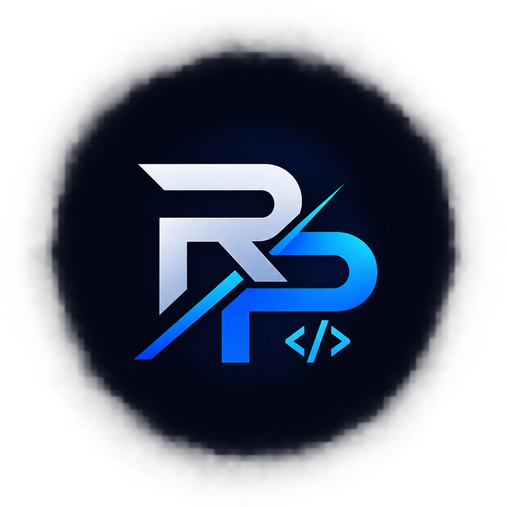

<div align="center">



# Ricardo P/ — Portafolio Personal

### Desarrollador Full Stack junior en construcción constante 🚀

[](https://git.io/typing-svg)

<p>
  
  
  
  
</p>

<p>
  
  
  
  
</p>

**[🌐 Ver demo en vivo](#)** · **[📩 Contacto](#-contacto)** · **[🗂️ Proyectos](#️-proyectos-destacados)**

</div>

---

## 📖 Sobre este portafolio

Este es mi portafolio profesional, construido desde cero con **React + Vite + Tailwind CSS**.
Incluye modo claro/oscuro, selector de idioma (ES/EN), animaciones de entrada con
Framer Motion y una sección de proyectos con estudios de caso reales: el problema
que resolví y cómo lo resolví.

> "Cada proyecto de este portafolio nace de un problema concreto y termina en una
> solución que funciona." 

## ✨ Características

- 🌗 **Modo claro / oscuro** con transición suave y persistencia de preferencia
- 🌍 **Bilingüe (ES/EN)** vía `i18next`, con todo el contenido centralizado en JSON
- 🎬 **Animaciones fluidas** de entrada y scroll con `framer-motion`
- 📱 **100% responsive**, mobile-first
- 🖼️ **Fallback automático de imágenes** — si falta una foto, se muestra un placeholder con iniciales
- 🧮 **Contadores animados** (proyectos, tecnologías, etc.)
- 🗂️ **Estudios de caso por proyecto**: problema → solución → stack → link

## 🧰 Stack técnico

<p>
  
</p>

| Categoría   | Tecnologías |
|-------------|-------------|
| Frontend    | React 18, Vite, Tailwind CSS, Framer Motion, Lucide Icons |
| i18n        | i18next, react-i18next |
| Navegación  | react-scroll |
| Calidad     | ESLint |

## 🚀 Cómo correrlo localmente

```bash
# 1. Clona el repositorio
git clone https://github.com/Ricardo-Palomino/<nombre-del-repo>.git
cd <nombre-del-repo>

# 2. Instala dependencias
npm install

# 3. Levanta el entorno de desarrollo
npm run dev
```

Abre **http://localhost:5173** 🎉

### Otros comandos disponibles

| Comando           | Descripción                                  |
|--------------------|-----------------------------------------------|
| `npm run dev`       | Servidor de desarrollo con hot reload         |
| `npm run build`     | Genera la versión de producción en `dist/`    |
| `npm run preview`   | Sirve localmente el build de producción       |
| `npm run lint`      | Corre ESLint sobre el proyecto                |

## 🖼️ Agregar tus imágenes

El sitio funciona sin ellas (muestra un marco con las iniciales del proyecto),
pero para que se vea completo agrega estos archivos en `public/img/`:

| Archivo             | Dónde se usa                  |
|-----------------------|--------------------------------|
| `foto.jpg`             | Foto personal en el Hero        |
| `cover.jpg`            | Imagen del laptop en la portada |
| `gymmaster.jpg`        | Proyecto GymMaster CLI          |
| `innova.jpg`           | Proyecto INNOVA-ASISTE          |
| `dataflix.jpg`         | Proyecto DataFlix                |
| `shopverse.jpg`        | Proyecto ShopVerse                |
| `foodstars.jpg`        | Proyecto FoodStars                 |

No necesitas tocar código: en cuanto el archivo exista en esa ruta, el
componente lo muestra automáticamente.

## 🗂️ Proyectos destacados

| Proyecto | Descripción | Stack | Enlace |
|----------|-------------|-------|--------|
| 🍽️ **FoodStars** | Plataforma fullstack para descubrir, calificar y compartir restaurantes, con panel de administración. | React · Node.js · Express · MongoDB | [Ver proyecto](https://ricardo-palomino.github.io/Copia-Fronted-FoodStars/) |
| 🛒 **ShopVerse** | Tienda en línea conectada a FakeStore API con catálogo, filtros y experiencia responsiva. | HTML · CSS · JS · Tailwind | [Ver proyecto](https://github.com/Ricardo-Palomino/proyecto-de-Javascript) |
| 🎬 **DataFlix** | Plataforma educativa con cursos, quizzes y seguimiento de progreso. | HTML · CSS · JS | [Ver proyecto](https://github.com/DanielSantiagoV/DataFlix) |
| 🏋️ **GymMaster CLI** | CLI interactiva para gestionar socios y pagos de gimnasios. | Node.js · MongoDB · Inquirer.js | [Ver proyecto](https://github.com/DanielSantiagoV/GymMaster_CLI) |
| 🎓 **INNOVA-ASISTE** | Herramienta para centralizar el registro de asistencia estudiantil. | Python · CLI · JSON | [Ver proyecto](https://github.com/Ricardo-Palomino/INNOVA-ASISTE) |

## 📂 Estructura del proyecto

portfolio-react/
├── public/
│ └── img/ # Imágenes estáticas (proyectos, portada, favicon)
├── src/
│ ├── components/ # Navbar, Cover, Hero, About, Skills, Projects, Contact, Footer
│ ├── hooks/ # useTheme, useScrollAnimation
│ ├── locales/ # es.json, en.json — todo el contenido textual
│ ├── i18n.js # Configuración de i18next
│ ├── App.jsx
│ └── index.css # Tokens de color claro/
oscuro + estilos Tailwind
├── index.html
├── tailwind.config.js
├── vite.config.js
└── package.json


## ✏️ Editar contenido

Casi todo el texto vive en `src/locales/es.json` y `src/locales/en.json`
(mismas claves en ambos archivos, solo cambia el idioma). El stack técnico
de la sección About y los niveles de las barras de habilidades están
directamente en `About.jsx` y `Skills.jsx`.

Para agregar un nuevo proyecto:
1. Agrega la imagen en `public/img/<slug>.jpg`
2. Súmalo al arreglo `SLUGS` en `src/components/Projects.jsx`
3. Agrega el objeto correspondiente en `projects.items` dentro de `es.json` y `en.json`

## 🗺️ Roadmap

- [x] Modo claro/oscuro
- [x] Soporte bilingüe ES/EN
- [x] Sección de proyectos con estudios de caso
- [ ] Blog técnico
- [ ] Sección de certificaciones
- [ ] Tests con Vitest / React Testing Library

## 📬 Contacto

<p>
  <a href="mailto:Rp0459510@gmail.com"></a>
  <a href="https://www.linkedin.com/in/ricardo-palomino-7650a3365/"></a>
  <a href="https://github.com/Ricardo-Palomino"></a>
</p>

---

<div align="center">

Hecho con mucho **Carño** por **Ricardo Palomino** — Santa Marta, Colombia 🇨🇴

⭐ Si te gustó este portafolio, ¡considera dejar una estrella al repo!

</div>